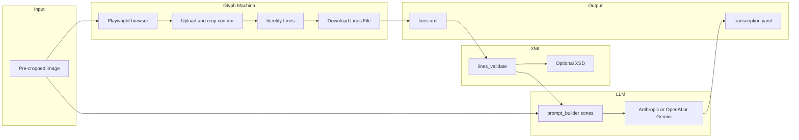

# Architecture

- **transcriber_shell.glyph_machina** — Playwright-only; no public Glyph Machina HTTP API is used.
- **transcriber_shell.xml_tools** — stdlib XML parse + optional `lxml` XSD.
- **transcriber_shell.llm** — Imports `prompt_builder` and `validate_schema` from `vendor/transcription-protocol/benchmark/` at runtime (`protocol_paths.ensure_protocol_benchmark_on_path`).
- **transcriber_shell.pipeline.run** — Sequences steps and writes `artifacts/<job_id>/`.
