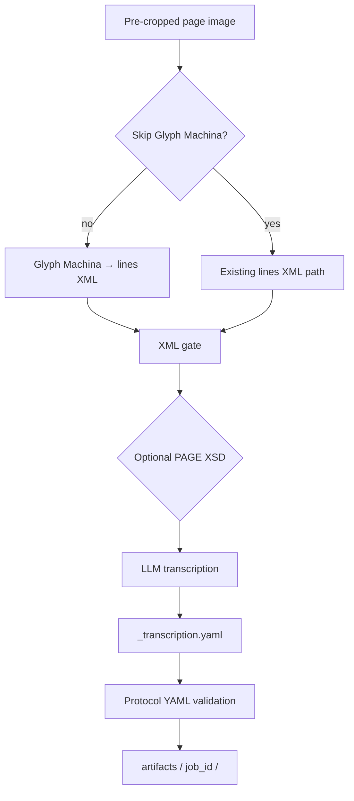

# Architecture (living overview)

## Pipeline diagram

**XML gate** applies `validate_lines_xml` (optional strict `TextLine` rule) and, when configured, XSD validation.

## Stages and surfaces

**transcriber-shell** orchestrates:

1. **Lineation** — Browser automation against [Glyph Machina](https://glyphmachina.com/) (`transcriber_shell.glyph_machina`) to produce a lines XML for a pre-cropped page image, unless `--skip-gm` / GUI “Skip Glyph Machina” supplies existing XML.
2. **XML gate** — Well-formed XML; optional enforcement of ≥1 `TextLine` (CLI `--no-require-text-line` / `TRANSCRIBER_SHELL_XML_REQUIRE_TEXT_LINE` / GUI checkbox); optional PAGE XSD when `xsd_path` is set (CLI `--xsd`, `TRANSCRIBER_SHELL_LINES_XML_XSD`, GUI; `lxml` via `pip install 'transcriber-shell[xml-xsd]'`). Implemented in `transcriber_shell.xml_tools`.
3. **LLM** — `prompt_builder` + provider adapters (`transcriber_shell.llm`) produce protocol-shaped YAML; models listed in `llm/model_catalog.py`.
4. **Validation** — Vendored `validate_schema` from `vendor/transcription-protocol/benchmark/` (submodule required).
5. **Outputs** — `artifacts/<job_id>/` (lines XML, transcription YAML, etc.).

**Surfaces:**

- **CLI** — `transcriber-shell run`, `batch`, `validate-*`, etc.
- **GUI** — `transcriber-shell gui` (`transcriber_shell.gui`): primary actions in a **bottom bar** so run controls stay visible on short windows; optional XML-gate fields mirror CLI/env defaults.
- **HTTP API (optional)** — FastAPI under `transcriber_shell.api` (`pip install '.[api]'`), `serve` command.

**Protocol code** lives in the submodule `vendor/transcription-protocol/`; runtime adds `benchmark/` to `sys.path` for `prompt_builder` and validators.

Other deep dives: [glyph-machina-automation.md](glyph-machina-automation.md).

---

**Doc workflow inspiration:** [Axel Edin (@axlolo)](https://github.com/axlolo). Adapted for transcriber-shell.
