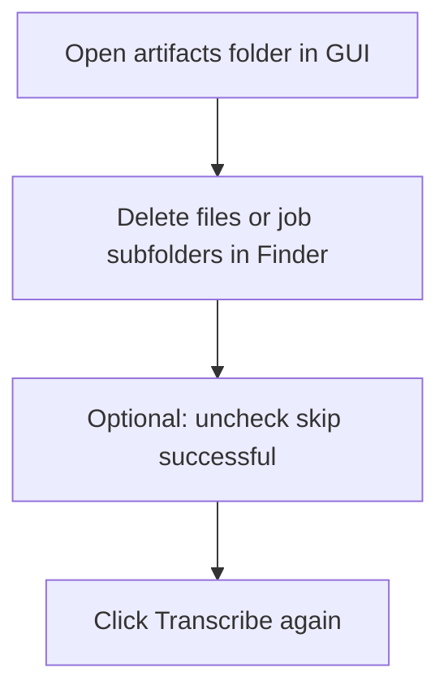

# Delete old outputs and rerun in the GUI

The app does **not** delete pipeline outputs from inside the GUI. You remove files in the artifacts folder (or via the shell), adjust the **skip successful** checkbox if needed, then run **Transcribe** again in the same GUI session or after a restart.

## What the GUI does and does not do

- **Outputs** live under **`artifacts/<job_id>/`** (default `./artifacts`, configurable via `TRANSCRIBER_SHELL_ARTIFACTS_DIR`).
- **Open artifacts folder** opens that directory in Finder/Explorer so you can delete files manually.
- **Remove selected** (image list) only removes paths from the list in the UI; it does **not** delete files on disk.
- **Skip jobs that already have a successful transcription** skips a run when `<image_stem>_transcription.yaml` exists **and** validates. If you want a full redo, either turn this **off** or delete those YAML files (or the whole job folder).

## Recommended deletion scope (pick one)

| Goal | What to delete |
|------|----------------|
| **Redo LLM only** (keep lines XML from Glyph Machina) | In `artifacts/<job_id>/`, delete only `*_transcription.yaml` (and any partial copies). |
| **Redo lineation + LLM** | Delete the entire `artifacts/<job_id>/` folder for that page (or all job folders you care about). |
| **Narrow reset** | Delete only the failing page’s folder (e.g. `cursive_deed_2/`) if stems match your sanitized job id (see `sanitize_job_id` in `pipeline/batch.py`). |

**Naming:** Job IDs come from the **image stem** (sanitized). Filenames with spaces become underscores in `job_id` (e.g. `cursive deed 2.jpg` → `cursive_deed_2`).

## Steps in the GUI

1. Click **Open artifacts folder**.
2. In Finder (or Explorer), delete the files or `job_id` subfolders you chose above.
3. If you are **not** deleting valid `*_transcription.yaml` files, ensure **Skip jobs that already have a successful transcription** is **unchecked** (otherwise completed pages may still be skipped).
4. Confirm **prompt**, **provider/keys**, **lineation** (Glyph Machina vs skip + lines XML), and **images** are set as intended.
5. Click **Transcribe** (no need to quit the app unless you want a clean restart; **relaunch** = quit `transcriber-shell gui` and start it again if you changed `.env` on disk and want a fresh process).

## After changing `.env` outside the GUI

If you edited `.env` while the GUI was open, **relaunch** the GUI so environment-based settings reload, or use fields that override env for that session.

## See also

- [recovery-batch.md](recovery-batch.md) — mixed batch failures (GM vs LLM)
- [simple-workflow.md](simple-workflow.md) — pipeline order
