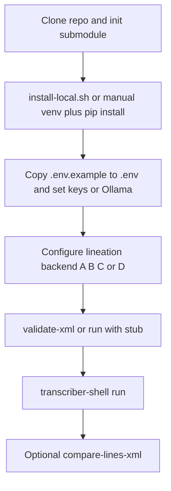

# Local setup (run effectively)

End state: from a **git checkout** you can lineate a pre-cropped page, validate lines XML, run full transcription with an LLM, and optionally compare local line XML to a Glyph Machina export—without missing submodules, dependencies, or environment variables.

## Prerequisites

- **Python 3.11+** (see [`pyproject.toml`](../pyproject.toml)).
- **Git** with submodule support.

## 1. Clone and protocol submodule

Transcription and **`validate-yaml`** require the protocol submodule:

```bash
git clone <your-fork-or-upstream-url> transcription-shell
cd transcription-shell
git submodule update --init --recursive vendor/transcription-protocol
```

Or clone once with: `git clone --recurse-submodules <url>`.

If `vendor/transcription-protocol/benchmark/validate_schema.py` is missing, `validate-yaml` and the full pipeline will fail until the submodule is initialized.

### Optional: latin_documents training data

Line-segmentation **training** uses external datasets (this app only **loads** trained weights). To use **[ideasrule/latin_documents `data/`](https://github.com/ideasrule/latin_documents/tree/master/data)** (paired images + PageXML), run `./scripts/clone-latin-documents.sh` and read **[latin-documents-training-data.md](latin-documents-training-data.md)**.

## 2. Virtual environment and dependencies

### Recommended: installer script

**Linux / macOS**

```bash
chmod +x scripts/install-local.sh   # once, if needed
./scripts/install-local.sh
source .venv/bin/activate
```

**Windows (PowerShell)**

```powershell
Set-ExecutionPolicy -Scope CurrentUser RemoteSigned   # once, if needed
.\scripts\install-local.ps1
.\.venv\Scripts\Activate.ps1
```

The script creates `.venv`, installs editable **`[api,gemini,xml-xsd,dev]`**, runs **`playwright install chromium`** (for the **glyph_machina** lineation backend), and attempts submodule init.

### Manual install

```bash
python3 -m venv .venv
source .venv/bin/activate
pip install -U pip
pip install -e ".[api,dev,gemini,xml-xsd]"
playwright install chromium
```

Add extras only when needed:

```bash
pip install -e ".[mask]"     # scipy / opencv / torch helpers for custom mask inference
pip install -e ".[kraken]"   # Kraken BLLA lineation
```

## 3. Environment file

```bash
cp .env.example .env
```

Edit **`.env`** (never commit it):

- Set **at least one** LLM key: `ANTHROPIC_API_KEY`, `OPENAI_API_KEY`, or `GOOGLE_API_KEY`, **or**
- Use **Ollama** locally: run `ollama serve`, `ollama pull` a vision model, set `TRANSCRIBER_SHELL_DEFAULT_PROVIDER=ollama` and `TRANSCRIBER_SHELL_OLLAMA_MODEL` as needed.

See [.env.example](../.env.example) for lineation and API variables.

## 4. Choose a lineation backend

Set `TRANSCRIBER_SHELL_LINEATION_BACKEND` or pass `--lineation-backend` on the CLI.

| Backend | When to use | Essentials |
|--------|-------------|------------|
| **`mask`** (default) | Local or private model | Set `TRANSCRIBER_SHELL_MASK_INFERENCE_CALLABLE` and/or `TRANSCRIBER_SHELL_MASK_PRED_NPY_PATH`. See [mask-lineation-plugin.md](mask-lineation-plugin.md). Optional: `TRANSCRIBER_SHELL_MASK_WEIGHTS_PATH`. |
| **`mask` + stub** | Wiring / CI smoke only | `pip install -e "examples/latin_lineation_stub"` then `TRANSCRIBER_SHELL_MASK_INFERENCE_CALLABLE=latin_lineation_stub.infer:predict_masks` (synthetic lines, not real segmentation). |
| **`kraken`** | Kraken BLLA | `pip install -e ".[kraken]"`, set `TRANSCRIBER_SHELL_KRAKEN_MODEL_PATH` to a `.mlmodel`, tune `KRAKEN_DEVICE` / thresholds. |
| **`glyph_machina`** | No local ML | Playwright + network; see [glyph-machina-automation.md](glyph-machina-automation.md). |

GPU (CUDA): set `MASK_DEVICE` or `KRAKEN_DEVICE` to `cuda:0` when your stack supports it.

## 5. Smoke checks

```bash
source .venv/bin/activate
pytest
transcriber-shell validate-xml path/to/lines.xml --require-text-line
```

Artifacts default to **`artifacts/<job_id>/`** (`TRANSCRIBER_SHELL_ARTIFACTS_DIR`).

## 6. Full pipeline (CLI)

```bash
transcriber-shell run \
  --job-id myjob \
  --image ./page.png \
  --prompt ./fixtures/prompt.example.yaml \
  --provider anthropic
```

Use **`--skip-gm`** and **`--lines-xml`** only when you already have a lines file from another tool.

## 7. Compare local line XML to Glyph Machina

Treat the **reference** file as perfect ground truth:

```bash
transcriber-shell compare-lines-xml \
  -r glyph_machina-lines.xml \
  -y artifacts/myjob/lines.xml
```

Tune **`--centroid-match-px`** if line pairing is poor. See [`xml_tools/lines_compare.py`](../src/transcriber_shell/xml_tools/lines_compare.py).

## 8. GUI and HTTP API

- **GUI:** `transcriber-shell gui` — keys in UI or `.env`; pick **lineation backend** when not skipping automated lineation.
- **API:** `transcriber-shell serve` (requires `[api]` extra). Lineation uses the same `.env` as the CLI; the HTTP route does not support `skip_gm`—use the CLI for offline lines XML.

## 9. Docker

For a reproducible environment without managing Playwright/GPU on the host: **[README-DOCKER.md](../README-DOCKER.md)** and `./docker-run.sh shell`. Mount the repo and provide `.env` or environment variables for keys.

## 10. Troubleshooting

| Symptom | What to check |
|---------|----------------|
| `validate_schema` / protocol errors | `git submodule update --init vendor/transcription-protocol` |
| Mask: “requires … INFERENCE_CALLABLE” | Set `MASK_INFERENCE_CALLABLE` and install the plugin, or set `MASK_PRED_NPY_PATH` |
| Kraken import error | `pip install -e ".[kraken]"` |
| Glyph Machina timeout / UI failure | `TRANSCRIBER_SHELL_GM_TIMEOUT_MS`, network, site availability; try `--lineation-backend` alternatives |
| Transcription fails with auth errors | Keys in `.env` or use Ollama |
| Playwright / Chromium missing | `playwright install chromium` |

## Workflow overview



---

**See also:** [README.md](../README.md) (overview), [mask-lineation-plugin.md](mask-lineation-plugin.md) (plugin contract), [ARCHITECTURE.md](ARCHITECTURE.md) (pipeline diagram).
